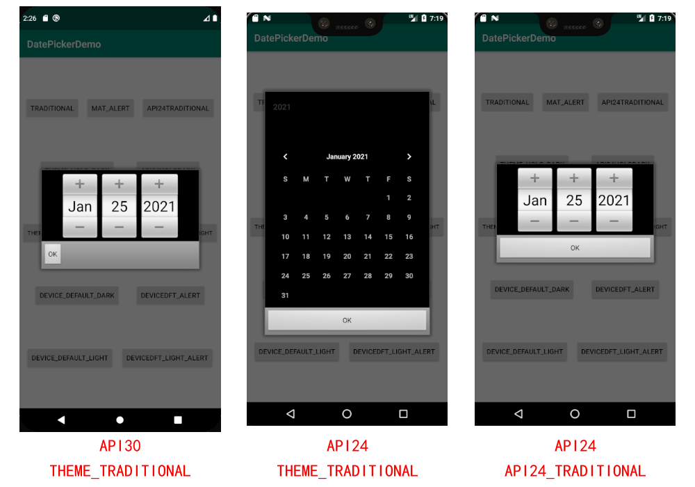
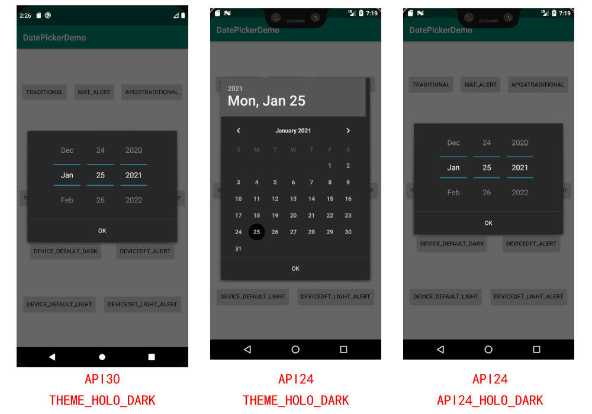
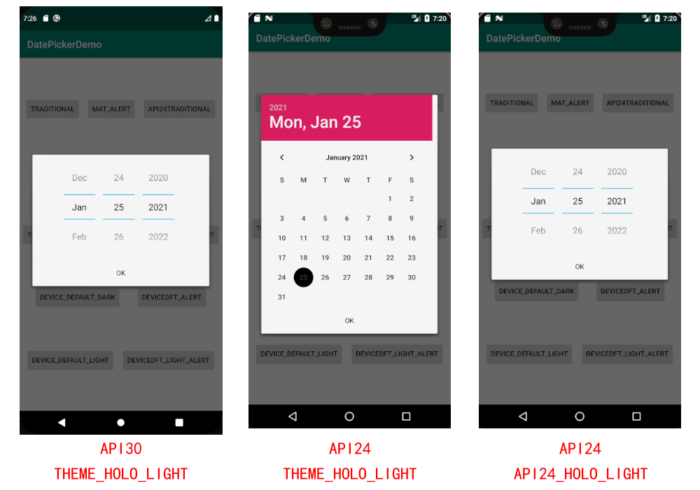
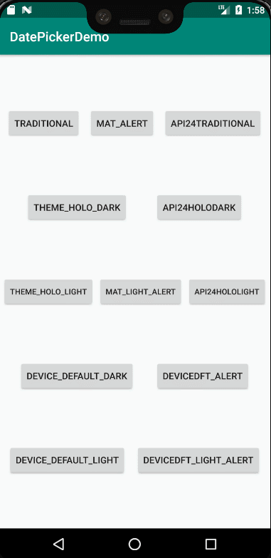
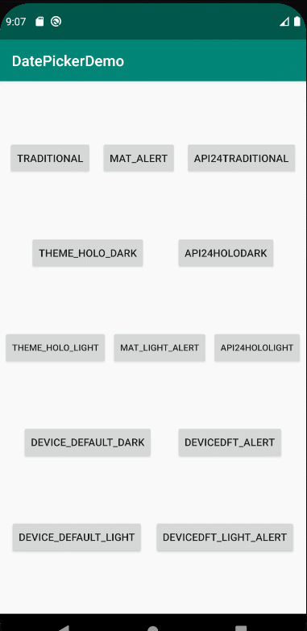

# DatePickerDemoForAndroid24
解决 DatePickerDialog 在 Android7.0 API24 上使用`AlertDialog.THEME_TRADITIONAL`、`AlertDialog.THEME_HOLO_DARK`、`AlertDialog.THEME_HOLO_LIGHT`等样式时无法显示为 Spinner 样式的问题。
***
## API24 无法显示 Spinner 样式
在设备 API24 时，调用`DatePickerDialog`来选择日期和时间时，如果指定的主题为`THEME_TRADITIONAL`、`THEME_HOLO_DARK`或`THEME_HOLO_LIGHT`，会出现和其他 API Level 不一样的对话框。

- THEME_TRADITIONAL
    
- THEME_HOLO_DARK
    
- THEME_HOLO_LIGHT
    

## 解决方式
在`Build.VERSION.SDK_INT == 24`时做特殊处理，传入对应 theme 的ContextThemeWrapper，使用 DatePickerDialogForAndroid24 来展示 Spinner 样式的 DatePickerDialog。
```
    /**
     * Api24下显示Spinner样式的Dialog
     * @param theme ContextThemeWrapper的theme与DialogTheme的对应关系如下
     *              android.R.style.Theme_Dialog -> AlertDialog.THEME_TRADITIONAL
     *              android.R.style.Theme_Holo -> AlertDialog.THEME_HOLO_DARK
     *              android.R.style.Theme_Holo_Light -> AlertDialog.THEME_HOLO_LIGHT
     */
    private fun showDatePickerDialogApi24(theme: Int) {
        val themeContext =
            ContextThemeWrapper(this@MainActivity, theme)
        try {
            val dialog = DatePickerDialogForAndroid24(
                themeContext,
                null,
                Calendar.getInstance().get(Calendar.YEAR),
                Calendar.getInstance().get(Calendar.MONTH),
                Calendar.getInstance().get(Calendar.DAY_OF_MONTH)
            )
            dialog.create()
            dialog.getButton(DialogInterface.BUTTON_NEGATIVE).visibility = View.GONE
            dialog.show()
        } catch (e: Exception) {
            showAlertDialog(e.toString())
            e.printStackTrace()
        }
    }
```
## 完整演示
- API24

- API30
